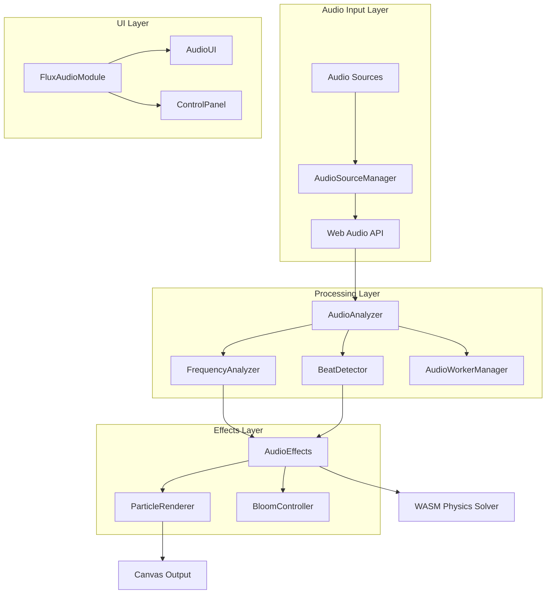

# FLUX Audio Reactive Mode - Developer Guide

## Architecture Overview

The FLUX Audio Reactive system is built with a modular architecture that separates audio processing, analysis, and visual effects into distinct components. This design ensures high performance, maintainability, and extensibility.



## Core Components

### AudioAnalyzer (`src/audio/core/audio-analyzer.js`)

The main audio processing class that coordinates all audio analysis operations.

```javascript
class AudioAnalyzer {
    constructor(options = {}) {
        this.audioContext = null
        this.analyserNode = null
        this.sourceManager = new AudioSourceManager()
        this.frequencyAnalyzer = new FrequencyAnalyzer()
        this.performanceMonitor = new AudioPerformanceMonitor()
        this.workerManager = new AudioWorkerManager()
        this.fftOptimizer = new FFTOptimizer()
    }
    
    async initialize(inputSource = 'microphone') {
        // Initialize Web Audio API context
        // Setup audio source connection
        // Configure frequency analysis
        // Start performance monitoring
    }
    
    getFrequencyData() {
        // Returns comprehensive frequency analysis
        return {
            bass: 0.0,      // 0-1 normalized
            mids: 0.0,      // 0-1 normalized
            treble: 0.0,    // 0-1 normalized
            overall: 0.0,   // 0-1 normalized
            spectrum: [],   // Full frequency spectrum
            advanced: {},   // Advanced analysis data
            timestamp: 0,   // Analysis timestamp
            analysisTime: 0 // Processing time in ms
        }
    }
}
```

### AudioEffects (`src/audio/core/audio-effects.js`)

Translates audio data into visual effects and particle behaviors.

```javascript
class AudioEffects {
    constructor(fluxApp, options = {}) {
        this.fluxApp = fluxApp
        this.currentMode = options.mode || 'reactive'
        this.effectIntensity = options.intensity || 1.0
        this.smoothingFactor = options.smoothingFactor || 0.7
    }
    
    processAudioData(audioData, beatData) {
        // Apply mode-specific effects
        switch (this.currentMode) {
            case 'pulse': this.applyPulseMode(audioData, beatData); break
            case 'flow': this.applyFlowMode(audioData, beatData); break
            case 'reactive': this.applyReactiveMode(audioData, beatData); break
            case 'ambient': this.applyAmbientMode(audioData, beatData); break
        }
        
        // Update visual effects
        this.updateBloomEffect(audioData, beatData)
        this.updateParticleColors(audioData)
    }
}
```

### FluxAudioModule (`src/audio/core/flux-audio-module.js`)

Modular UI component that provides audio reactive controls with FLUX aesthetic.

```javascript
class FluxAudioModule {
    constructor(fluxApp, options = {}) {
        this.fluxApp = fluxApp
        this.options = {
            position: options.position || 'top-left',
            compact: options.compact || false,
            theme: options.theme || 'flux'
        }
        
        this.createModule()
        this.setupInteractions()
        this.startAnimations()
    }
    
    async toggleAudioMode() {
        // Handle audio mode toggle with proper error handling
        // Update UI state and visual indicators
        // Manage audio permissions and fallbacks
    }
}
```

## Audio Processing Pipeline

### 1. Audio Input Capture

```javascript
// AudioSourceManager handles multiple input sources
class AudioSourceManager {
    async connectSource(sourceType) {
        switch (sourceType) {
            case 'microphone':
                return await this.connectMicrophone()
            case 'system':
                return await this.connectSystemAudio()
            default:
                throw new Error(`Unsupported source: ${sourceType}`)
        }
    }
    
    async connectSystemAudio() {
        try {
            const stream = await navigator.mediaDevices.getDisplayMedia({
                audio: {
                    echoCancellation: false,
                    noiseSuppression: false,
                    autoGainControl: false
                },
                video: false
            })
            return { success: true, stream, source: 'system' }
        } catch (error) {
            // Fallback to microphone
            return await this.connectMicrophone()
        }
    }
}
```

### 2. Frequency Analysis

```javascript
// FrequencyAnalyzer provides advanced frequency processing
class FrequencyAnalyzer {
    analyzeFrequencies(frequencyData) {
        return {
            bass: this.calculateFrequencyRange(frequencyData, 'bass'),
            mids: this.calculateFrequencyRange(frequencyData, 'mids'),
            treble: this.calculateFrequencyRange(frequencyData, 'treble'),
            spectrum: this.generateSpectrum(frequencyData),
            peaks: this.detectPeaks(frequencyData),
            harmonics: this.analyzeHarmonics(frequencyData)
        }
    }
    
    calculateFrequencyRange(data, range) {
        const bins = this.frequencyRanges[range].bins
        let sum = 0
        let weight = 0
        
        for (const bin of bins) {
            const value = data[bin] / 255
            const binWeight = this.getBinWeight(bin, range)
            sum += value * binWeight
            weight += binWeight
        }
        
        return weight > 0 ? sum / weight : 0
    }
}
```

### 3. Beat Detection

```javascript
// BeatDetector implements energy-based beat detection
class BeatDetector {
    detectBeat(frequencyData) {
        const energy = this.calculateInstantEnergy(frequencyData)
        const avgEnergy = this.getAverageEnergy()
        const variance = this.calculateVariance()
        
        const threshold = this.config.varianceMultiplier * variance
        const isBeat = energy > (avgEnergy + threshold) && 
                      energy > this.config.minimumEnergy &&
                      this.timeSinceLastBeat() > this.config.minBeatInterval
        
        if (isBeat) {
            this.recordBeat(energy, avgEnergy, threshold)
        }
        
        return {
            isBeat,
            energy,
            strength: isBeat ? this.calculateBeatStrength(energy, threshold) : 0,
            bpm: this.calculateBPM(),
            confidence: this.calculateConfidence()
        }
    }
}
```

## Performance Optimization

### Web Workers

Heavy audio processing is moved to Web Workers to maintain 60fps rendering:

```javascript
// audio-worker.js
self.onmessage = function(e) {
    const { frequencyData, timeData, config } = e.data
    
    // Perform heavy analysis in worker thread
    const analysis = {
        frequency: analyzeFrequencies(frequencyData, config),
        beat: detectBeat(frequencyData, config),
        spectrum: generateSpectrum(frequencyData, config),
        performance: { processTime: performance.now() - startTime }
    }
    
    self.postMessage(analysis)
}
```

### Adaptive Quality

The system automatically reduces quality under performance pressure:

```javascript
class AudioPerformanceMonitor {
    measureAnalysis(analysisFunction, category) {
        const startTime = performance.now()
        const result = analysisFunction()
        const analysisTime = performance.now() - startTime
        
        this.recordAnalysisTime(category, analysisTime)
        
        if (analysisTime > this.config.targetAnalysisTime) {
            this.handlePerformanceWarning(category, analysisTime)
        }
        
        return result
    }
    
    handlePerformanceWarning(category, analysisTime) {
        if (this.consecutiveWarnings > this.config.warningThreshold) {
            this.reduceQuality()
        }
    }
    
    reduceQuality() {
        // Reduce FFT size, disable advanced features, etc.
        this.applyQualitySettings({
            fftSize: Math.max(512, this.currentSettings.fftSize / 2),
            advancedAnalysisEnabled: false,
            spectrumResolution: Math.max(64, this.currentSettings.spectrumResolution / 2)
        })
    }
}
```

## Visual Effects Implementation

### Particle Color Modulation

```javascript
updateAudioColors(hue, saturation = 1.0, lightness = 0.5) {
    const rgb = this.hslToRgb(hue / 360, saturation, lightness)
    const color = (rgb.r << 16) | (rgb.g << 8) | rgb.b
    
    this.particleGraphics.forEach(particle => {
        if (particle && particle.visible) {
            particle.clear()
            
            // Redraw particle with new color
            this.drawParticleWithColor(particle, color)
        }
    })
}
```

### Bloom Effect Control

```javascript
updateBloomIntensity(intensity) {
    const bloomFilter = this.container.filters.find(f => 
        f.constructor.name.includes('Bloom')
    )
    
    if (bloomFilter) {
        const clampedIntensity = Math.max(0.5, Math.min(3.0, intensity))
        bloomFilter.bloomScale = this.baseBloomScale * clampedIntensity
    }
}
```

### Force Application

```javascript
applyReactiveMode(audioData, beatData) {
    // Bass affects gravity and central forces
    if (this.smoothedBass > 0.1) {
        const centerX = this.fluxApp.config.containerWidth / 2
        const centerY = this.fluxApp.config.containerHeight / 2
        const bassRadius = 100 + (this.smoothedBass * 100)
        const bassStrength = this.smoothedBass * 0.5 * this.effectIntensity
        
        if (this.fluxApp.solver) {
            this.fluxApp.solver.apply_force(centerX, centerY, bassRadius, bassStrength)
        }
    }
    
    // Beat detection creates pulse waves
    if (beatData.isBeat) {
        this.createBeatPulse(beatData.strength)
    }
}
```

## Integration Guide

### Adding Audio Reactive to Existing Projects

1. **Install Dependencies**
```javascript
import { AudioAnalyzer, AudioEffects, FluxAudioModule } from './src/audio/index.js'
```

2. **Initialize Audio System**
```javascript
class YourApp {
    async setupAudio() {
        this.audioAnalyzer = new AudioAnalyzer({
            fftSize: 2048,
            smoothingTimeConstant: 0.8
        })
        
        this.audioEffects = new AudioEffects(this, {
            mode: 'reactive',
            intensity: 1.0
        })
        
        this.audioModule = new FluxAudioModule(this, {
            position: 'top-left',
            theme: 'flux'
        })
    }
}
```

3. **Process Audio in Render Loop**
```javascript
renderLoop() {
    if (this.audioReactiveEnabled) {
        const audioData = this.audioAnalyzer.getFrequencyData()
        const beatData = this.beatDetector.detectBeat(audioData.spectrum)
        
        this.audioEffects.processAudioData(audioData, beatData)
    }
    
    // Continue with normal rendering
    this.updatePhysics()
    this.renderParticles()
}
```

## Custom Effect Development

### Creating New Visualization Modes

```javascript
class CustomAudioEffects extends AudioEffects {
    applyCustomMode(audioData, beatData) {
        // Your custom visualization logic
        const bassIntensity = audioData.bass
        const trebleSparkle = audioData.treble
        
        // Apply custom forces
        this.applyCustomForces(bassIntensity)
        
        // Create custom visual effects
        this.createCustomSparkles(trebleSparkle)
        
        // Modify particle properties
        this.updateCustomColors(audioData)
    }
    
    applyCustomForces(intensity) {
        // Example: Spiral force based on bass
        const time = performance.now() * 0.001
        const spiralX = this.fluxApp.config.containerWidth / 2 + 
                      Math.cos(time + intensity * 10) * 100
        const spiralY = this.fluxApp.config.containerHeight / 2 + 
                      Math.sin(time + intensity * 10) * 100
        
        if (this.fluxApp.solver) {
            this.fluxApp.solver.apply_force(spiralX, spiralY, 80, intensity)
        }
    }
}
```

### Custom Audio Analysis

```javascript
class CustomFrequencyAnalyzer extends FrequencyAnalyzer {
    analyzeCustomFeatures(frequencyData) {
        return {
            ...super.analyzeFrequencies(frequencyData),
            
            // Custom analysis features
            spectralCentroid: this.calculateSpectralCentroid(frequencyData),
            spectralRolloff: this.calculateSpectralRolloff(frequencyData),
            zeroCrossingRate: this.calculateZeroCrossingRate(frequencyData),
            mfcc: this.calculateMFCC(frequencyData)
        }
    }
    
    calculateSpectralCentroid(data) {
        let weightedSum = 0
        let magnitudeSum = 0
        
        for (let i = 0; i < data.length; i++) {
            const magnitude = data[i] / 255
            const frequency = (i * this.sampleRate) / (2 * data.length)
            
            weightedSum += frequency * magnitude
            magnitudeSum += magnitude
        }
        
        return magnitudeSum > 0 ? weightedSum / magnitudeSum : 0
    }
}
```

## Testing and Debugging

### Performance Testing

```javascript
// Test audio processing performance
async function testAudioPerformance() {
    const analyzer = new AudioAnalyzer()
    await analyzer.initialize('microphone')
    
    const benchmark = await analyzer.runPerformanceBenchmark()
    console.log('Performance Results:', benchmark)
    
    // Expected results:
    // - Analysis time < 2ms for 60fps
    // - Memory usage stable over time
    // - No audio dropouts or glitches
}
```

### Visual Effect Testing

```javascript
// Test visual effects with synthetic audio data
function testVisualEffects() {
    const mockAudioData = {
        bass: 0.8,
        mids: 0.6,
        treble: 0.4,
        overall: 0.6,
        spectrum: new Array(1024).fill(0).map(() => Math.random() * 255)
    }
    
    const mockBeatData = {
        isBeat: true,
        strength: 1.5,
        bpm: 120,
        confidence: 0.9
    }
    
    audioEffects.processAudioData(mockAudioData, mockBeatData)
}
```

### Debug Commands

```javascript
// Available in browser console
window.audioDebug = {
    getState: () => fluxApp.audioState,
    getPerformance: () => fluxApp.audioAnalyzer.getPerformanceStats(),
    testMode: (mode) => fluxApp.setAudioMode(mode),
    testSensitivity: (value) => fluxApp.setAudioSensitivity(value),
    benchmark: () => fluxApp.audioAnalyzer.runPerformanceBenchmark()
}
```

## Browser Compatibility

### Supported Features by Browser

| Feature | Chrome | Edge | Firefox | Safari |
|---------|--------|------|---------|--------|
| Web Audio API | ✅ | ✅ | ✅ | ⚠️ |
| getUserMedia | ✅ | ✅ | ✅ | ✅ |
| getDisplayMedia | ✅ | ✅ | ⚠️ | ❌ |
| System Audio | ✅ | ✅ | ❌ | ❌ |
| Web Workers | ✅ | ✅ | ✅ | ✅ |
| WebGL | ✅ | ✅ | ✅ | ✅ |

### Fallback Strategies

```javascript
// Detect browser capabilities and apply fallbacks
class BrowserCompatibility {
    static detectCapabilities() {
        return {
            webAudio: !!(window.AudioContext || window.webkitAudioContext),
            getUserMedia: !!(navigator.mediaDevices && navigator.mediaDevices.getUserMedia),
            getDisplayMedia: !!(navigator.mediaDevices && navigator.mediaDevices.getDisplayMedia),
            webWorkers: !!window.Worker,
            webGL: this.detectWebGL()
        }
    }
    
    static applyFallbacks(capabilities) {
        if (!capabilities.getDisplayMedia) {
            console.warn('System audio not supported, using microphone only')
            // Disable system audio option in UI
        }
        
        if (!capabilities.webWorkers) {
            console.warn('Web Workers not supported, using main thread processing')
            // Disable worker-based processing
        }
    }
}
```

## API Reference

### AudioAnalyzer API

```typescript
interface AudioAnalyzer {
    initialize(inputSource: 'microphone' | 'system'): Promise<InitResult>
    switchSource(newSource: string, options?: SwitchOptions): Promise<SwitchResult>
    getFrequencyData(): FrequencyData
    updateFrequencyConfig(config: FrequencyConfig): void
    getPerformanceStats(): Promise<PerformanceStats>
    dispose(): void
}

interface FrequencyData {
    bass: number        // 0-1 normalized
    mids: number        // 0-1 normalized
    treble: number      // 0-1 normalized
    overall: number     // 0-1 normalized
    spectrum: number[]  // Full frequency spectrum
    timeData: number[]  // Time domain data
    timestamp: number   // Analysis timestamp
    analysisTime: number // Processing time in ms
}
```

### AudioEffects API

```typescript
interface AudioEffects {
    processAudioData(audioData: FrequencyData, beatData: BeatData): void
    setMode(mode: 'pulse' | 'reactive' | 'flow' | 'ambient'): void
    setIntensity(intensity: number): void
    setSmoothingFactor(factor: number): void
    reset(): void
}

interface BeatData {
    isBeat: boolean
    energy: number
    strength: number    // 0-2 range
    bpm: number
    confidence: number  // 0-1 range
}
```

### FluxAudioModule API

```typescript
interface FluxAudioModule {
    constructor(fluxApp: FluxApp, options: ModuleOptions)
    toggleAudioMode(): Promise<boolean>
    updateState(state: 'disabled' | 'enabling' | 'enabled' | 'error'): void
    destroy(): void
}

interface ModuleOptions {
    position?: 'top-left' | 'top-right' | 'bottom-left' | 'bottom-right'
    compact?: boolean
    theme?: 'flux' | 'minimal' | 'custom'
}
```

---

*FLUX Audio Reactive Mode Developer Guide - Build immersive audio-visual experiences*